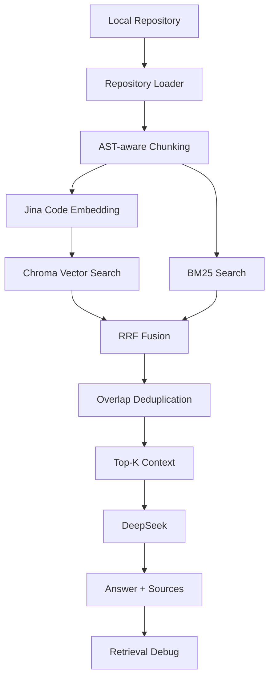

# RepoMind

RepoMind is a RAG-based open-source repository learning assistant that combines AST-aware chunking, code embeddings, hybrid retrieval, and source-level citations.

It answers natural-language questions about a local codebase ("How is self-attention implemented?"), points back to the exact file / symbol / lines it used, and shows the retrieval ranking that produced each answer.

---

## Overview

RepoMind indexes a local repository, chunks it with AST-aware structure (for Python) and fixed-size chunks (for Markdown), embeds chunks with a code embedding model, and stores them in Chroma. A query is answered through a hybrid pipeline — dense vector search + BM25, fused with Reciprocal Rank Fusion (RRF), de-duplicated, and grounded through DeepSeek — with every answer citing its sources.

The Streamlit UI exposes:

- Repository indexing (path -> index -> indexed summary)
- A chat workspace backed by the real RAG pipeline
- A Sources inspector (file, symbol, lines, source code preview)
- A Retrieval Debug panel (vector / BM25 / RRF ranks and scores)
- An explicit "Insufficient repository context" refusal state

## Why RepoMind

- **Developer-focused.** The goal is to understand an unfamiliar codebase, not to produce marketing text.
- **Grounded answers.** DeepSeek is prompted to answer only from the retrieved context and to cite `[Source N]`.
- **Transparent retrieval.** Every answer can be audited: which chunks were retrieved, in what order, and by which retriever.
- **Honest about limits.** Retrieval debug, refusals, and a candid Limitations section are first-class.

## Demo

See `docs/demo/README.md` for the planned demo screenshots:

1. `01-indexed-repository.png` — indexed repository summary
2. `02-self-attention-answer.png` — a grounded answer with sources
3. `03-retrieval-debug.png` — vector / BM25 / RRF debug
4. `04-insufficient-context.png` — the refusal state on a negative question

## Features

- Python AST-aware chunking; Markdown fixed chunking (`chunk_size=1200`, `chunk_overlap=200`)
- Code embeddings: `jinaai/jina-embeddings-v2-base-code` (768 dims)
- Hybrid retrieval: Chroma vector search + BM25 + RRF fusion (k=60) + overlap dedup
- DeepSeek-grounded answers with `[Source N]` citations
- Sources inspector with file / symbol / lines / code preview
- Retrieval debug with vector, BM25, and RRF ranks and raw scores
- Refusal state for insufficient context (no similarity threshold)
- Streamlit UI with real indexing, chat history, citation/source linking, and "Clear conversation"

## Architecture



Current defaults:

- Python: AST-aware chunking
- Markdown: fixed-size chunking
- Embedding: `jinaai/jina-embeddings-v2-base-code`
- Vector store: Chroma (cosine, HNSW)
- Lexical retrieval: BM25
- Fusion: RRF (k=60)
- LLM: DeepSeek (`deepseek-chat`)
- Reranker: **currently disabled by default**

## RAG Pipeline

```
Question
   |
   +-- Vector Search (Top-15, Jina code embeddings)
   +-- BM25 (Top-15)
   |
   +--> RRF Fusion (k=60)
   |
   +--> Overlap Deduplication (threshold 0.30)
   |
   +--> Top-K Context (default k=5)
   |
   +--> DeepSeek (grounded generation)
   |
   +--> Answer + [Source N] citations + Retrieval Debug
```

`repo_rag.rag(question, top_k=5, min_similarity=0)` is the single entry point used by the UI. The similarity gate is kept at 0 (disabled), matching the evaluation setup.

## Chunking Strategy

- **Python:** AST-aware chunking produces symbol chunks (`ast_symbol`, `ast_symbol_split` for large symbols), class-context chunks, and residual chunks. This keeps definitions like `CausalSelfAttention.forward` or `GPT.from_pretrained` as first-class retrievable units.
- **Markdown:** fixed-size chunking with the same 1200/200 window.

For nanoGPT this yields 90 chunks: 28 AST symbol chunks, 39 AST residual chunks, 6 class-context chunks, and 17 fixed/Markdown chunks.

## Hybrid Retrieval

- **Vector:** Jina code embedding, cosine distance in Chroma.
- **BM25:** Porter-stemmed tokenizer over the same chunks.
- **RRF:** `1 / (k + rank)` fusion of both rank lists, k=60.
- **Dedup:** line-overlap removal (threshold 0.30) to keep Top-K slots diverse.
- **Reranker:** two CrossEncoder rerankers were evaluated and both regressed Top-1; the reranker is **off** in the default pipeline (see Experiments).

## Evaluation

All numbers below come from the reports in `evaluation/`. They are measured on **nanoGPT** and should not be interpreted as universal performance across arbitrary repositories.

### 24-question evaluation (current configuration)

`AST chunking + Jina Code + Vector + BM25 + RRF + Dedup + DeepSeek` (reranker off, threshold=0).

```
File Hit@1   = 91.7%  (22/24)
File Hit@3   = 95.8%  (23/24)
File Hit@5   = 95.8%  (23/24)

Symbol Hit@1 = 46.2%  (6/13 symbol-oriented questions)
Symbol Hit@3 = 76.9%  (10/13)
Symbol Hit@5 = 76.9%  (10/13)
```

Known misses on this set: `Q15` (mixed precision, file-level), and symbol-level `GPT.generate`, `GPT._init_weights`, `GPTConfig`.

### Negative / refusal evaluation

```
Correct Refusal Rate = 4/4 = 100%
Hallucinated Answer   = 0/4
```

DeepSeek refused all four out-of-scope questions (RLHF, vision transformer, beam search, backtranslation) instead of fabricating answers.

### Experiment comparison (6-question evaluation)

| Pipeline | Hit@1 | Hit@3 | Hit@5 |
| -------- | ----: | ----: | ----: |
| MiniLM + Vector | 66.7% | 83.3% | 83.3% |
| MiniLM + Hybrid | 66.7% | 83.3% | 100% |
| Jina + Fixed + Hybrid | 83.3% | 100% | 100% |
| Jina + AST + Hybrid | 100% | 100% | 100% |

> Note: the last row (Jina + AST + Hybrid) comes from the earlier **6-question evaluation**, not the 24-question one. On the larger 24-question set the same pipeline measures File Hit@1 = 91.7%. The two numbers must not be mixed.

## Refusal / Grounding

- DeepSeek's system prompt requires answering only from the retrieved repository context and explicitly saying so when the context is insufficient.
- The UI detects explicit refusal wording in the answer text and renders the `Insufficient repository context` state instead of a generic error. This is text-level presentation logic only — there is **no** similarity threshold and no hard-coded retrieval rule.
- On refusal, the actually-retrieved Sources and Retrieval Debug remain visible so the failure is inspectable.

## Installation

```bash
git clone <repository>
cd repomind

python -m venv .venv
```

Windows:

```bash
.venv\Scripts\activate
```

macOS / Linux:

```bash
source .venv/bin/activate
```

Install dependencies:

```bash
pip install -r requirements.txt
```

Create the environment file:

```bash
cp .env.example .env
```

Then fill in `DEEPSEEK_API_KEY` (and optionally `DEEPSEEK_MODEL` / `EMBEDDING_MODEL`). `.env` is gitignored.

> Python 3.13 on Windows CPU was used for development. The pinned `transformers==4.51.0` / `huggingface_hub==0.36.2` / `tokenizers==0.21.4` trio is required for `jina-embeddings-v2-base-code` compatibility.

## Usage

```bash
streamlit run app.py
```

1. Enter a local repository path
2. Click **Index repository**
3. Wait for indexing to complete (Files / Chunks / strategy / embedding shown)
4. Ask questions in the chat
5. Inspect **Sources** (file / symbol / lines / code preview)
6. Expand **Retrieval details** to audit vector / BM25 / RRF ranks

## Project Structure

```text
repomind/
├── app.py               # Streamlit UI entry point (indexing + chat orchestration)
├── repo_rag.py          # RAG pipeline: load -> chunk -> embed -> hybrid search -> DeepSeek
├── repo_loader.py       # Repository file discovery (.py / .md)
├── chunker.py           # Fixed-size chunking (Markdown fallback)
├── ast_chunker.py       # AST-aware Python chunking
├── hybrid_retriever.py  # Standalone experimental hybrid retrieval (not used by the current pipeline)
├── ui/
│   ├── __init__.py
│   ├── styles.py        # All custom CSS
│   └── components.py    # Reusable UI components
├── design-system/
│   └── MASTER.md        # Visual / interaction design spec
├── evaluation/          # Experiment and evaluation reports
├── docs/demo/           # Demo screenshot plan
├── requirements.txt
├── .env.example
└── .gitignore
```

## Experiments & Lessons Learned

The experiment log, in order:

```text
Vector baseline
↓
Dedup experiment
↓
Hybrid Vector + BM25 + RRF
↓
General reranker regression
↓
Python code reranker regression
↓
Jina Code Embedding
↓
AST-aware Chunking
↓
Extended Evaluation
↓
Streamlit MVP
```

- **Dedup did not improve Hit@K** (66.7/83.3/83.3 before and after on the 6-question set). It is still kept as a safety mechanism so overlapping chunks do not waste Top-K slots.
- **Hybrid retrieval improved recall**: Hit@5 rose from 83.3% to 100% on the 6-question set (BM25 + RRF recovered the `sample.py` generation loop on Q6).
- **Both CrossEncoder rerankers caused Top-1 regression** and were therefore not adopted:
  - MS MARCO (`cross-encoder/ms-marco-MiniLM-L6-v2`): Hit@1 dropped to 33.3% (vs 66.7% hybrid).
  - Python code reranker (`NamanAgnih0tri/code-reranker-miniLM-staqc`): Hit@1 50.0% (better than MS MARCO, still below hybrid 66.7%), with the same README-over-code promotions on Q3/Q4.
- **Jina Code embedding clearly improved file-level retrieval**: Hit@1 66.7% -> 83.3%, Hit@3 83.3% -> 100% (Jina + Fixed + Hybrid).
- **AST chunking alone (with MiniLM) regressed Q6** (File Hit@5 100% -> 83.3%); the embedding could not exploit the new symbol headers.
- **AST + Jina became the default**: 100/100/100 file Hit@K on the 6-question set, resolving the Q5 README bias, with `CausalSelfAttention.*` and `GPT.from_pretrained` reaching Top-1.
- **Extended 24-question evaluation** showed the 6-question 100% was not fully maintained (File Hit@1 91.7%) and that symbol-level retrieval (Hit@1 46.2%) is meaningfully weaker than file-level retrieval.

We do **not** claim that symbol-level retrieval is solved. `GPT.generate` remains a documented hard case (it is split across two chunks, BM25-strong but vector-weak).

## Limitations

- Symbol-level retrieval is still clearly weaker than file-level retrieval (24-question Symbol Hit@1 = 46.2% vs File Hit@1 = 91.7%).
- `GPT.generate` is a known hard case: the symbol is split into two chunks and misses the final Top-5.
- AST-aware chunking currently supports **Python only**; Markdown uses fixed-size chunking.
- Single-repository mode: one repository indexed at a time; re-indexing clears the previous chat.
- DeepSeek latency depends on network and API availability.
- The refusal UI currently identifies refusals from answer text markers; it is not a retrieval-time classifier.
- Evaluation is based primarily on nanoGPT and does not generalize automatically.
- No reranker is enabled by default (see Experiments).
- No query rewriting, agent orchestration, or GraphRAG.

## Future Work

- A symbol-aware reranker is the highest-value next step (the current candidates regressed Top-1).
- Query rewriting for vocabulary-gap questions (e.g., the mixed-precision case).
- Broader evaluation across multiple repositories and languages.
- Multi-repository / workspace mode.
- GraphRAG or AST-graph structures for cross-symbol reasoning.