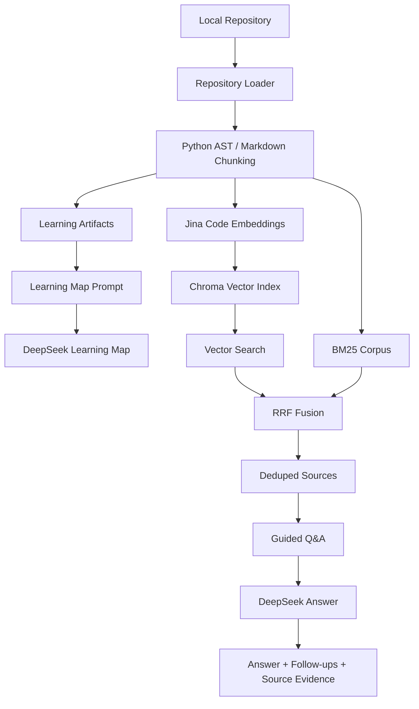

# RepoMind

RepoMind is an AI open-source project learning assistant for beginners who want to understand unfamiliar codebases.

It indexes a local Python / Markdown repository, builds a Learning Map after indexing, and answers guided questions with source evidence. The core experience is:

- **Learning Map:** a first-pass project summary, entry points, reading order, and starter questions.
- **Guided Q&A:** intent-aware answers for project overview, feature implementation, AI concepts, configuration, and file/symbol questions.
- **Source Evidence:** every grounded answer is expected to cite `[Source N]`, with file, symbol, line range, source role, and retrieval debug available for inspection.

RepoMind is not a code editor or an autonomous coding agent. Its current goal is repository understanding and learning.

---

## Product Positioning

RepoMind is designed for AI learners reading real open-source projects. Instead of only returning a generic RAG answer, it tries to guide the learning process:

1. Index the repository.
2. Generate a Learning Map.
3. Offer starter questions.
4. Classify the user's question intent.
5. Retrieve relevant source chunks.
6. Compose a grounded answer prompt.
7. Show follow-up questions, source evidence, and retrieval debug.

This keeps the product focused on learning workflows: where to start, how a feature is implemented, how an AI concept appears in code, and which source files support the answer.

## Current Implemented Capabilities

- Indexes local `.py` and `.md` repositories.
- Uses Python AST-aware chunking for Python files and fixed-size chunking for Markdown.
- Generates embeddings with `jinaai/jina-embeddings-v2-base-code`.
- Stores the index in Chroma.
- Retrieves with dense vector search + BM25 + Reciprocal Rank Fusion (RRF) + overlap deduplication.
- Generates a Learning Map after a successful index run.
- Displays Learning Map starter questions.
- Lets starter questions enter the same chat flow as manual questions.
- Supports Guided Q&A for:
  - project overview questions
  - feature implementation questions
  - AI concept questions grounded in repository code
  - configuration questions
  - file or symbol questions
- Labels retrieved sources with source roles such as documentation, entry point, model logic, training logic, inference logic, configuration, test, utility, and core implementation.
- Shows source inspector details: file, symbol, lines, code preview, source role, and relevance reason.
- Shows retrieval debug: vector / BM25 / RRF ranks and scores.
- Shows follow-up questions under assistant answers.
- Refuses or marks insufficient-context answers when evidence is not enough.

## Technology Stack

- **UI:** Streamlit
- **Vector store:** Chroma
- **Embeddings:** Jina code embeddings (`jinaai/jina-embeddings-v2-base-code`, 768 dimensions)
- **Lexical retrieval:** BM25
- **Rank fusion:** Reciprocal Rank Fusion (RRF, k=60)
- **Generation:** DeepSeek through an OpenAI-compatible client
- **Chunking:** Python AST-aware chunking plus Markdown fixed chunking

## Architecture



## Guided Q&A Flow

The Streamlit chat no longer treats generation as a single generic RAG call. It uses the existing backend retrieval, then adds a learning-oriented orchestration layer:

```text
Question
   |
   +--> classify question intent
   +--> plan query hints
   +--> repo_rag.hybrid_search()
   +--> normalize and label sources
   +--> build intent-specific answer prompt
   +--> DeepSeek
   +--> AnswerResult
   +--> Markdown answer + follow-ups + source inspector
```

The existing `repo_rag.py` retrieval behavior remains the low-level retrieval backend. The Learning modules sit around it and do not change Chroma indexing, vector search, BM25, RRF, or dedup behavior.

## Learning Map Flow

After indexing succeeds, RepoMind builds Learning artifacts from the repository documents and chunks:

- file profiles
- project profile
- selected Learning Map sources
- Learning Map prompt
- generated Learning Map

If Learning Map generation fails, the repository index remains available and chat can still be used. The UI records the Learning Map error instead of treating it as an indexing failure.

## Basic Usage

```bash
streamlit run app.py
```

1. Enter a local repository path.
2. Click **Index repository**.
3. Wait for indexing to complete.
4. Review the Learning Map when available.
5. Click a starter question or type your own question.
6. Read the structured Markdown answer.
7. Inspect **Sources** for file, symbol, lines, source role, relevance reason, and code preview.
8. Expand **Retrieval details** to audit vector / BM25 / RRF rankings.

## Evaluation

Evaluation assets live in `evaluation/`.

Existing retrieval evaluations are based on **nanoGPT** and should not be treated as universal performance claims:

```text
File Hit@1   = 91.7%  (22/24)
File Hit@3   = 95.8%  (23/24)
File Hit@5   = 95.8%  (23/24)

Symbol Hit@1 = 46.2%  (6/13 symbol-oriented questions)
Symbol Hit@3 = 76.9%  (10/13)
Symbol Hit@5 = 76.9%  (10/13)
```

Known misses include mixed precision retrieval and several symbol-level cases such as `GPT.generate`, `GPT._init_weights`, and `GPTConfig`.

The Learning MVP adds:

- `evaluation/learning_eval_questions.json`: a 19-question nanoGPT Learning evaluation set covering overview, feature, concept, configuration, and negative/refusal questions.
- `evaluation/learning_eval_template.md`: a manual evaluation template for retrieval quality, answer grounding, learning usefulness, follow-up quality, refusal behavior, failure classification, and final judgment.

## Refusal And Grounding

RepoMind prompts DeepSeek to answer only from retrieved repository evidence and cite repository facts with `[Source N]`.

When evidence is insufficient, the answer should say so clearly. The UI keeps sources and retrieval debug visible so failures can be inspected instead of hidden.

Negative evaluation currently checks out-of-scope questions such as RLHF, vision transformers, beam search, and data augmentation/backtranslation.

## Project Structure

```text
repomind/
|-- app.py                    # Streamlit entry point and app orchestration
|-- repo_rag.py               # indexing, embeddings, Chroma, hybrid retrieval, DeepSeek backend helpers
|-- repo_loader.py            # .py / .md repository file discovery
|-- chunker.py                # fixed-size chunking
|-- ast_chunker.py            # Python AST-aware chunking
|-- learning/                 # Learning Map and Guided Q&A pure modules
|-- ui/
|   |-- components.py         # Streamlit rendering components
|   `-- styles.py             # custom CSS
|-- evaluation/               # retrieval reports and Learning MVP evaluation assets
|-- docs/                     # implementation notes and demo planning
|-- requirements.txt
|-- .env.example
`-- .gitignore
```

## Installation

```bash
git clone <repository>
cd repomind

python -m venv .venv
```

Windows:

```bash
.venv\Scripts\activate
```

macOS / Linux:

```bash
source .venv/bin/activate
```

Install dependencies:

```bash
pip install -r requirements.txt
```

Create the environment file:

```bash
cp .env.example .env
```

Then fill in `DEEPSEEK_API_KEY`. You may also set `DEEPSEEK_MODEL` and `EMBEDDING_MODEL`. `.env` is gitignored.

Python 3.13 on Windows CPU was used for development. The pinned `transformers==4.51.0` / `huggingface_hub==0.36.2` / `tokenizers==0.21.4` versions are required for `jina-embeddings-v2-base-code` compatibility.

## Current Limits

- Only Python and Markdown files are loaded.
- Python is the only AST-aware language. Markdown uses fixed-size chunking.
- RepoMind does not edit code.
- MCP is not supported.
- Multi-language AST parsing is not supported.
- Full call graph generation is not supported.
- Local LLM execution is not supported.
- The product is still primarily single-repository learning.
- Re-indexing rebuilds the Chroma collection for the current repository.
- BM25 is rebuilt per query from the Chroma collection.
- DeepSeek latency and availability depend on network and API health.
- Symbol-level retrieval is weaker than file-level retrieval.
- The Learning Map is generated after indexing but is not a complete architectural proof; it is a grounded learning aid.

## Future Work

- Broader Learning MVP evaluation across more repositories.
- Better symbol-level retrieval.
- Query rewriting for vocabulary-gap questions.
- Deeper source-role and learning-path evaluation.
- Multi-repository or workspace mode.
- Call graph or AST graph support.
- Optional local LLM support.

## License

[MIT](LICENSE) © 2026 nancy-summer55
